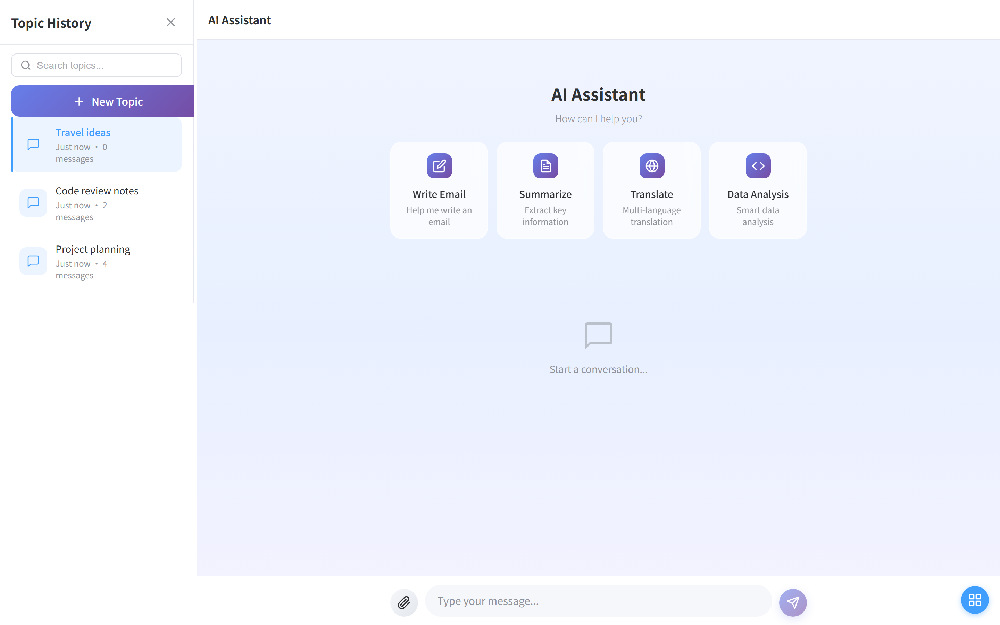
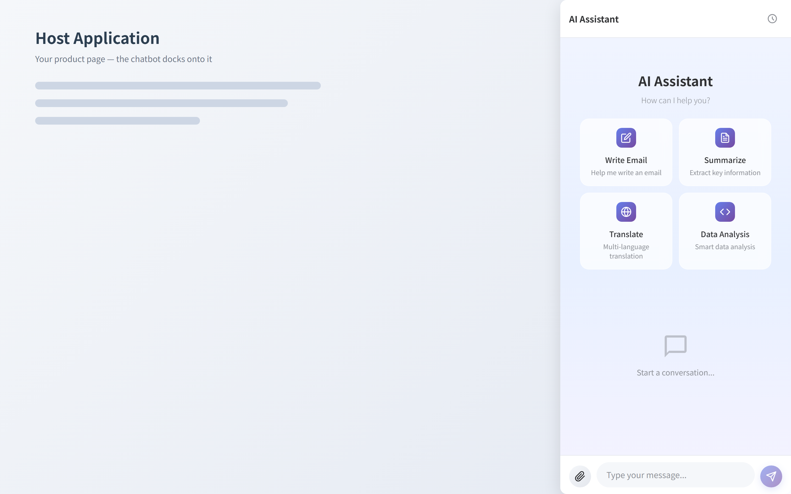
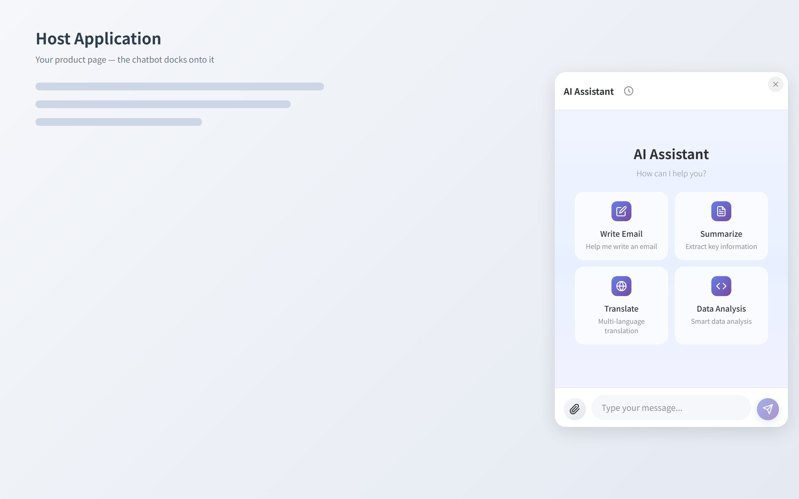

# AI Chatbot Frontend

[](https://github.com/dliting/chatbot-front/actions/workflows/ci.yml)

A Vue 3 + TypeScript + Element Plus AI chatbot component library that can be embedded in any website — as a Vue component or a framework-agnostic iframe. Ships with a full-stack example app (mock & real LLM backends) and runs fully offline.

## Modes

The component has a dual-dimension interaction architecture — **interaction mode** (how it is embedded) and **layout** (derived automatically from the mode):

| Mode | Layout | Description | Use Case |
|------|--------|-------------|----------|
| **Extended** | Dual (sidebar + chat) | Full-page chat application with topic sidebar | Desktop-first chat application |
| **Sidebar** | Single (tab-switched) | Embedded side panel | Side panel inside an existing app |
| **Floating** | Single | Floating ball that opens a draggable chat window | Space-saving, on-demand access |

### Extended — full-page dual layout



### Sidebar — side panel docked on the host page



### Floating — draggable chat window



## Features

- **Multi-modal input**: text and image upload, file preview (docx / excel / pdf / images)
- **Streaming responses**: SSE with real-time typewriter effect and timeout control
- **Thinking / Chain-of-Thought**: collapsible reasoning display
- **Quick actions**: configurable welcome-screen actions with built-in SVG icons and `{{variable}}` prompt substitution
- **Topic management**: multi-conversation sessions with search, rename, delete
- **Theme support**: light / dark / system, customizable primary color
- **Three-tier fallback**: host callbacks → REST API (`apiBaseUrl`) → local-only behavior
- **i18n**: `zh-CN` / `en-US` with fully overridable labels
- **Multiple embed modes**: Vue component or iframe (works with any host framework)
- **Style isolated**: no conflicts with host page styles

## Installation

```bash
npm install ai-chatbot-frontend
```

Peer dependencies (optional, only needed for office file preview):

```bash
npm install @vue-office/docx @vue-office/excel @vue-office/pdf
```

Requirements: Vue >= 3.4, Node >= 18.

## Quick Start (Vue 3)

```vue
<template>
  <AIChatbot :config="chatConfig" @panel-toggle="handleToggle" />
</template>

<script setup lang="ts">
import { AIChatbot } from 'ai-chatbot-frontend'
import type { ChatbotConfig } from 'ai-chatbot-frontend'
import 'ai-chatbot-frontend/style.css'

const chatConfig: ChatbotConfig = {
  apiBaseUrl: '/api',
  mode: 'floating',
  theme: 'light',
  streamEnabled: true,
  enableImageUpload: true,
  enableThinking: true,
}

const handleToggle = (open: boolean) => console.log('panel', open)
</script>
```

### Iframe Embedding (any framework)

Build the iframe bundle and include it in any host page:

```bash
npm run build:iframe   # outputs to dist-iframe/
```

```html
<iframe src="/dist-iframe/index.html" style="border:0"></iframe>
```

Configure `iframeMode: true` and `allowedOrigins` in the chat config for postMessage-based communication with the host page.

## Configuration

```typescript
interface ChatbotConfig {
  // Interaction mode
  mode?: 'floating' | 'extended' | 'sidebar'   // default 'floating'
  layout?: 'dual' | 'single'                    // auto-derived from mode

  // Panel / floating window
  position?: 'top-left' | 'top-right' | 'bottom-left' | 'bottom-right'
  panelWidth?: number          // default 400
  panelHeight?: number         // default 600
  draggable?: boolean          // default true
  resizable?: boolean          // default true
  rememberPosition?: boolean   // default true

  // Features
  enableImageUpload?: boolean  // default true
  enableThinking?: boolean     // default false
  streamEnabled?: boolean      // default true
  streamTimeout?: number       // default 120000

  // Style & i18n
  theme?: 'light' | 'dark' | 'system'
  primaryColor?: string
  locale?: 'zh-CN' | 'en-US'
  labels?: Partial<ChatbotLabels>
  quickActions?: QuickAction[]
  promptVariables?: PromptVariableConfig

  // API & callbacks
  apiBaseUrl?: string           // default '/api'
  callbacks?: ChatbotCallbacks  // host-controlled operations
}
```

See [docs/API.md](docs/API.md) for the complete configuration reference, callbacks/events API, attachment model, and injectable action keys for custom child components.

## Examples

A complete full-stack example lives in [`examples/chatapp`](examples/chatapp/README.md):

- **Mock mode** — Express + SQLite backend with canned responses, no LLM required
- **Real mode** — Express + SQLite + [Ollama](https://ollama.com) backend serving a local large language model

```bash
# from the repo root (Windows)
start-chatapp.bat mock   # backend :3001 + frontend :5180
start-chatapp.bat real   # backend :3000 (needs local Ollama) + frontend :5180
stop-chatapp.bat         # stop everything
```

## Development & Testing

```bash
npm install
npm run dev              # dev server at http://localhost:5173
npm run build:lib        # build the component library (dist/)
npm run lint             # ESLint (auto-fix)
npm run test:run         # unit + component tests (Vitest)
npm run test:coverage    # coverage report
npm run test:e2e         # Playwright e2e (lib + chatapp projects)
```

UI interaction testing guide: [tests/UI_TEST_GUIDE.md](tests/UI_TEST_GUIDE.md). Unit test coverage target: > 90%.

## Project Structure

```
src/
├── components/       # Vue components (chat panel, topics, input, previews)
├── composables/      # Composition API hooks
├── types/            # TypeScript types (config, messages, topics)
├── utils/            # Utilities (icons, storage, markdown)
├── styles/           # SCSS styles
├── entries/          # Demo entry points (extended / compact / floating)
├── constants/        # Centralized config constants
├── index.ts          # Library entry
└── iframe-entry.ts   # Iframe entry
examples/chatapp/     # Full-stack example (mock + real backends)
tests/                # Unit / component / e2e / UI tests
docs/                 # API, architecture and design documents
```

## Documentation

- [API Reference (v2.0)](docs/API.md) — configuration, callbacks, events, types
- [High-Level Design](docs/HLD.md) — architecture overview
- [Product Requirements](docs/PRD.md) / [Technical Design](docs/TDD.md)
- [Design notes](docs/design/) · [Feature docs](docs/features/)

## Contributing

Contributions are welcome — see [CONTRIBUTING.md](CONTRIBUTING.md). Please report vulnerabilities via [SECURITY.md](SECURITY.md) instead of public issues.

## License

[MIT](LICENSE)
